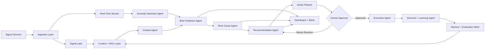
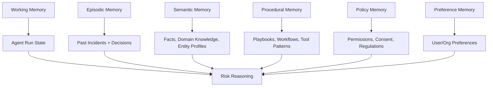
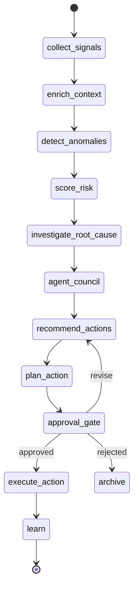
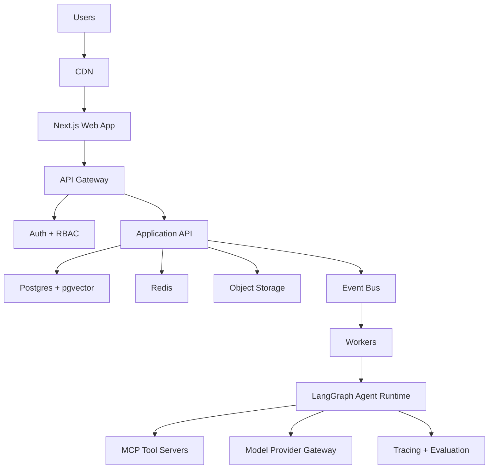

# PROJECT ANTIGRAVITY

**Tagline:** The AI that finds problems before people do.

**One-line concept:** Project Antigravity is a prevention-first, multi-agent intelligence platform that continuously observes authorized digital signals, detects weak signals of emerging problems, explains why they matter, and coordinates safe human-approved action before a crisis becomes visible.

**Product category:** Autonomous early-warning and action-planning platform for governments, businesses, communities, NGOs, and individuals.

**Core stance:** Not a chatbot. Not a dashboard with summaries. Antigravity is an always-on network of specialized agents that senses, reasons, collaborates, recommends, and learns.

---

## 1. Product Vision

Project Antigravity makes organizations and individuals feel like they have a calm, vigilant intelligence layer watching the horizon.

Most AI products respond after someone asks a question. Antigravity starts before the question exists. It watches approved signals, finds early patterns, explains uncertainty, and converts weak signals into concrete options for prevention.

The product vision is to become the **operating system for proactive problem prevention**:

- A public health team sees early dengue risk before hospitals are overloaded.
- A school district sees absenteeism and sentiment signals before dropout risk spikes.
- A factory sees procurement delays, machine vibration, and supplier news converge into a production risk.
- A parent sees family calendar, health, spending, and travel friction before the week collapses.
- A developer describes a new autonomous agent in plain language and deploys it into a governed agent network.

The user should feel: **"The system noticed something important, showed its reasoning, and gave me safe next steps."**

---

## 2. Problem Statement

Modern crises rarely appear from nowhere. They leave traces:

- Rising support tickets before churn.
- Small health complaints before outbreaks.
- Farm weather, soil, pest, and commodity signals before crop loss.
- Employee sentiment, absenteeism, and manager churn before HR risk.
- Logistics delays before retail stockouts.
- Calendar overload, sleep trends, and unresolved tasks before burnout.

The problem is that these traces are scattered across tools, teams, institutions, and formats. Humans notice them late because:

- Signals live in disconnected dashboards.
- Teams optimize for response, not prevention.
- Alerts are noisy and explain too little.
- AI assistants wait for prompts.
- High-impact action lacks governance, privacy, and approval controls.

Antigravity solves the missing layer: **continuous cross-signal interpretation with explainable agent collaboration and human-controlled execution.**

---

## 3. Why It Matters

Prevention changes economics and human outcomes.

- **Healthcare:** Earlier intervention reduces load on hospitals and public health teams.
- **Agriculture:** Early pest, weather, and supply risk detection protects yield and farmer income.
- **Education:** Early support can prevent dropout, absenteeism, and learning loss.
- **Disaster management:** Earlier mobilization saves time when minutes matter.
- **Business:** Churn, fraud, compliance, procurement, and operational bottlenecks are cheaper to prevent than repair.
- **Personal life:** People need coordinated help before calendar, money, health, and family obligations become stress.

Antigravity is designed around measurable impact:

- Time gained before incident recognition.
- False positive rate and precision.
- Cost avoided.
- People reached.
- Risk reduced after recommended intervention.
- Human approval latency for high-impact actions.

---

## 4. Competitive Analysis

| Player | Strength | Gap Antigravity Exploits |
|---|---|---|
| [Palantir AIP](https://www.palantir.com/platforms/aip/) | Enterprise data integration, ontology, operational AI, agent-style workflows. | Often enterprise-heavy and implementation-intensive. Antigravity is prevention-first, demoable fast, multi-domain by design, and centered on transparent weak-signal escalation. |
| [Datadog Watchdog / Bits AI](https://docs.datadoghq.com/watchdog/) | Strong observability, anomaly surfacing, incident workflows, AI agents, MCP support. | Focused mainly on technical and operational telemetry. Antigravity generalizes anomaly-to-action across civic, business, personal, and developer-created domains. |
| [BlueDot](https://bluedot.global/) | Infectious disease intelligence, outbreak alerts, forecasting, risk assessment. | Deep in health intelligence. Antigravity uses similar early-warning logic as a general agent network across many problem classes. |
| [Microsoft Security Copilot / Sentinel](https://learn.microsoft.com/en-us/azure/sentinel/security-copilot) | Security investigation and enterprise workflow integration. | Cyber-focused. Antigravity expands the investigation pattern to social, operational, health, disaster, and personal risk. |
| [ServiceNow AI Agents](https://www.servicenow.com/products/ai-agents.html) | Workflow automation, service operations, enterprise approvals. | Strong inside enterprise workflows. Antigravity starts from signal discovery and prevention rather than ticket resolution. |
| [Splunk ITSI](https://www.splunk.com/en_us/products/it-service-intelligence.html) | IT service health, anomaly detection, event correlation. | IT-centric. Antigravity combines business, public-sector, citizen, and personal contexts into one explainable prevention layer. |
| [C3 AI](https://c3.ai/products/c3-ai-applications/) | Enterprise AI applications for manufacturing, supply chain, predictive maintenance, energy, defense. | Application-suite oriented. Antigravity differentiates through natural-language agent creation, cross-domain signal fusion, and open MCP tool interoperability. |

**Positioning sentence:** Antigravity is what happens when epidemic intelligence, observability, enterprise ontology, agent orchestration, and human-approved automation converge into a prevention-first platform.

---

## 5. Unique Innovations

1. **Problem Discovery Graph**
   A living graph of entities, signals, anomalies, hypotheses, root causes, recommended actions, approvals, and outcomes.

2. **Weak Signal Fusion**
   Agents do not wait for a single metric to breach a threshold. They combine small movements across structured data, documents, social signals, calendars, sensors, tickets, weather, and news.

3. **Autonomous Agent Council**
   Specialized agents debate, cite evidence, challenge each other, and produce a confidence-weighted prevention plan.

4. **Explainability Timeline**
   Every risk has a timeline showing what changed, when it changed, which agents noticed, and why confidence rose or fell.

5. **Approval-Gated Execution**
   The platform can draft action, but high-impact execution requires human review with scope, blast radius, and reversibility clearly shown.

6. **Four-Domain Mode System**
   The same core intelligence engine supports Agents for Good, Agents for Business, Concierge Agents, and Freestyle developer agents.

7. **Natural-Language Agent Builder**
   Developers describe: "Watch city water complaints, rainfall, clinic cases, and social posts for contamination risk." Antigravity generates an agent spec, tools, memory policy, permissions, tests, and approval thresholds.

8. **Impact Ledger**
   Every recommendation records downstream impact: risk reduced, cost avoided, people notified, action accepted/rejected, and model learning.

---

## 6. End-to-End Architecture



**Core layers:**

- **Ingestion:** Connectors, webhooks, file uploads, public datasets, IoT streams, business SaaS, government open data, personal tools.
- **Signal Lake:** Raw and normalized event storage.
- **Knowledge Layer:** Entity graph, document index, vector database, domain ontologies, policy constraints.
- **Agent Runtime:** LangGraph for durable stateful orchestration, CrewAI for collaborative agent crews when useful, MCP for tool/data integration.
- **Decision Layer:** Risk scoring, anomaly detection, root-cause hypotheses, recommended interventions.
- **Governance Layer:** Consent, RBAC, approvals, audit trail, policy engine, PII handling.
- **Experience Layer:** Futuristic command dashboard, world map, heatmaps, timelines, agent conversations, personal/citizen/org/government/business views.

---

## 7. Agent Architecture

Each agent has:

- **Identity:** name, domain, mission, risk tier, owner.
- **Memory:** short-term state, long-term episodic memory, semantic memory, and tool-use history.
- **Reasoning:** model prompt, domain rules, confidence calibration, evidence requirements.
- **Planning:** task decomposition, dependency graph, retries, escalation rules.
- **Tool calling:** MCP tools, internal APIs, data connectors, retrieval tools, action tools.
- **Collaboration:** publishes findings to shared incident rooms and requests critique from peer agents.
- **Governance:** allowed data scopes, allowed actions, approval gates, audit log.

| Agent | Job | Key Inputs | Key Outputs |
|---|---|---|---|
| Signal Collection Agent | Continuously gathers authorized digital signals. | APIs, streams, documents, sensors, user uploads. | Normalized events, source quality score. |
| Context Agent | Enriches signals with domain context and historical baselines. | Entity graph, vector DB, policies, prior incidents. | Context bundle, comparable cases. |
| Anomaly Detection Agent | Detects unusual shifts and weak signals. | Time series, embeddings, event frequency, geospatial data. | Anomaly cards with severity and confidence. |
| Risk Prediction Agent | Estimates future probability, impact, and time horizon. | Anomalies, forecasts, domain models. | Risk score, expected impact, leading indicators. |
| Root Cause Analysis Agent | Builds causal hypotheses and evidence chains. | Signal graph, incident history, causal templates. | Ranked root causes with supporting/refuting evidence. |
| Recommendation Agent | Proposes interventions. | Root causes, constraints, best practices, playbooks. | Preventive actions, expected lift, tradeoffs. |
| Action Planner | Converts recommendations into executable plans. | Recommended actions, permissions, calendar/resources. | Step-by-step plan, blast radius, rollback. |
| Human Approval Agent | Routes decisions to the right human. | Risk tier, action type, org policy. | Approval request, redline diff, rationale. |
| Execution Agent | Performs approved actions. | MCP tools, APIs, credentials, approved plan. | Notifications, tickets, calendar changes, workflow updates. |
| Learning Agent | Measures outcomes and updates memory. | Accepted/rejected actions, impact metrics, feedback. | Updated heuristics, evaluation records. |

---

## 8. Database Schema

Recommended MVP stack: **Postgres + pgvector + Redis + object storage**.

```sql
create table organizations (
  id uuid primary key,
  name text not null,
  org_type text not null check (org_type in ('government','business','ngo','personal','developer')),
  region text,
  created_at timestamptz default now()
);

create table users (
  id uuid primary key,
  organization_id uuid references organizations(id),
  email text unique not null,
  role text not null,
  consent_profile jsonb default '{}',
  created_at timestamptz default now()
);

create table agents (
  id uuid primary key,
  organization_id uuid references organizations(id),
  name text not null,
  domain text not null,
  mission text not null,
  risk_tier text not null check (risk_tier in ('low','medium','high','critical')),
  policy jsonb not null,
  memory_config jsonb not null,
  tool_permissions jsonb not null,
  created_by uuid references users(id),
  created_at timestamptz default now()
);

create table signal_sources (
  id uuid primary key,
  organization_id uuid references organizations(id),
  source_type text not null,
  name text not null,
  connector_config jsonb not null,
  trust_score numeric default 0.7,
  status text default 'active',
  created_at timestamptz default now()
);

create table signals (
  id uuid primary key,
  organization_id uuid references organizations(id),
  source_id uuid references signal_sources(id),
  entity_id uuid,
  signal_type text not null,
  payload jsonb not null,
  geo geography(point, 4326),
  observed_at timestamptz not null,
  ingested_at timestamptz default now()
);

create table anomalies (
  id uuid primary key,
  organization_id uuid references organizations(id),
  agent_id uuid references agents(id),
  title text not null,
  severity text not null,
  confidence numeric not null,
  evidence jsonb not null,
  status text default 'open',
  detected_at timestamptz default now()
);

create table risks (
  id uuid primary key,
  organization_id uuid references organizations(id),
  anomaly_id uuid references anomalies(id),
  risk_type text not null,
  probability numeric not null,
  impact numeric not null,
  time_horizon text not null,
  explanation jsonb not null,
  created_at timestamptz default now()
);

create table recommendations (
  id uuid primary key,
  risk_id uuid references risks(id),
  title text not null,
  action_plan jsonb not null,
  expected_impact jsonb not null,
  confidence numeric not null,
  requires_approval boolean default true,
  created_at timestamptz default now()
);

create table approvals (
  id uuid primary key,
  recommendation_id uuid references recommendations(id),
  approver_id uuid references users(id),
  status text not null check (status in ('pending','approved','rejected','needs_changes')),
  notes text,
  decided_at timestamptz
);

create table executions (
  id uuid primary key,
  recommendation_id uuid references recommendations(id),
  execution_status text not null,
  tool_calls jsonb not null,
  result jsonb,
  executed_at timestamptz default now()
);

create table memories (
  id uuid primary key,
  organization_id uuid references organizations(id),
  agent_id uuid references agents(id),
  memory_type text not null check (memory_type in ('episodic','semantic','procedural','preference','policy')),
  content jsonb not null,
  embedding vector(1536),
  importance numeric default 0.5,
  created_at timestamptz default now()
);

create table audit_events (
  id uuid primary key,
  organization_id uuid references organizations(id),
  actor_type text not null,
  actor_id uuid,
  action text not null,
  target_type text,
  target_id uuid,
  metadata jsonb default '{}',
  created_at timestamptz default now()
);
```

---

## 9. API Architecture

**API style:** REST for product operations, WebSocket/SSE for live agent streams, GraphQL optional for dashboard composition.

| Endpoint | Purpose |
|---|---|
| `POST /v1/sources` | Register a new signal source or connector. |
| `POST /v1/signals/ingest` | Ingest normalized events. |
| `GET /v1/anomalies` | List anomalies with filters by domain, severity, region, entity, status. |
| `GET /v1/risks/:id` | Fetch risk detail, evidence, timeline, confidence factors. |
| `POST /v1/agents` | Create an agent from a structured or natural-language spec. |
| `POST /v1/agents/:id/run` | Trigger an agent manually. |
| `GET /v1/agent-runs/:id/stream` | Stream reasoning steps, tool calls, and collaboration events. |
| `POST /v1/recommendations/:id/approve` | Approve, reject, or request changes. |
| `POST /v1/executions/:id/cancel` | Cancel or rollback a running approved action. |
| `GET /v1/map/risk-tiles` | Serve geospatial heatmap tiles. |
| `GET /v1/timeline` | Return chronological risk/anomaly/action events. |
| `POST /v1/freestyle/compile` | Compile natural-language agent request into agent manifest. |

**Real-time event schema:**

```json
{
  "event": "agent.finding.created",
  "agent": "Risk Prediction Agent",
  "risk_id": "risk_123",
  "confidence": 0.82,
  "summary": "Dengue risk rising in Ward 7 within 10-14 days.",
  "evidence_count": 8,
  "requires_human_approval": true
}
```

---

## 10. Frontend Pages

Design language: **Apple calm + Linear precision + Arc spatial navigation + Notion AI clarity + Palantir operational gravity.**

**Visual system:**

- Deep graphite base, frosted panels, soft white typography, crisp borders.
- Accent colors by risk: cyan for signal, amber for warning, coral for urgent, red for critical, green for resolved.
- Subtle glass, not heavy sci-fi chrome.
- Rounded cards max 8px, compact toolbars, dense but breathable information.
- Confidence rings, risk chips, timeline rails, geospatial glow layers.
- Motion should communicate system state: scanning, escalating, awaiting approval, executing, learning.

### Core Screens

1. **Mission Control**
   - Global risk pulse, top emerging problems, live agent activity, approval queue.
   - Left rail: Domains, Agents, Map, Timeline, Approvals, Builder, Settings.

2. **Interactive World Map**
   - Heatmap layers: health, climate, supply chain, social, operational, personal.
   - Click a region to reveal anomaly stack, confidence, affected entities, and timeline.

3. **Live Anomaly Detection**
   - Streaming feed of detected weak signals.
   - Filters by severity, confidence, domain, geography, time horizon.

4. **Risk Detail**
   - Executive summary.
   - Confidence score and why it changed.
   - Evidence timeline.
   - Root cause tree.
   - Agent conversation transcript.
   - Recommended actions and approval status.

5. **Timeline Visualization**
   - Horizontal narrative of signal emergence.
   - Shows "first weak signal," "agent escalation," "human approval," "execution," "outcome."

6. **Multi-Agent Room**
   - Agent collaboration view with roles, claims, counterclaims, citations, tool calls.
   - Toggle between "Readable Summary" and "Raw Trace."

7. **Organization View**
   - Department/entity graph, owner map, active risks, SLA, resources, response readiness.

8. **Government Dashboard**
   - Regional risks, public services, disaster readiness, public health, citizen reports, resource deployment.

9. **Business Dashboard**
   - Revenue risk, churn, HR, fraud, operations, procurement, manufacturing, compliance.

10. **Citizen View**
   - Public risk advisories, trusted alerts, local resource availability, privacy-safe community reporting.

11. **Personal Dashboard**
   - Calendar stress, health signals, finance reminders, family coordination, travel risks, digital wellbeing.

12. **Freestyle Agent Builder**
   - Natural-language input.
   - Generated manifest preview.
   - Data permissions.
   - Tool permissions.
   - Evaluation tests.
   - Approval thresholds.
   - Deploy button.

---

## 11. Backend Structure

```text
antigravity/
  apps/
    web/                       # Next.js dashboard
    api/                       # FastAPI or NestJS API
    worker/                    # Celery/Temporal workers
    agent-runtime/             # LangGraph/CrewAI orchestration
  packages/
    ui/                        # Design system
    schemas/                   # Zod/Pydantic shared schemas
    connectors/                # SaaS, public data, IoT, MCP connectors
    risk-models/               # Forecasting and scoring models
    policies/                  # Approval, privacy, safety policies
  services/
    ingestion/
    anomaly-detection/
    rag/
    graph/
    approvals/
    execution/
    audit/
  infra/
    docker/
    terraform/
    k8s/
  docs/
    architecture.md
    demo-script.md
    threat-model.md
```

**Hackathon MVP stack:**

- Frontend: Next.js, TypeScript, Tailwind, shadcn/ui, Mapbox or deck.gl, Recharts/Visx.
- Backend: FastAPI, Python, Postgres, pgvector, Redis.
- Agents: LangGraph for flow, CrewAI optional for collaborative "agent council."
- Jobs: Celery or Temporal Lite.
- LLM: OpenAI, Anthropic, or local fallback through provider abstraction.
- Observability: LangSmith or OpenTelemetry traces.

---

## 12. AI Workflow

1. **Observe**
   Signal Collection Agent ingests approved sources.

2. **Normalize**
   Events are cleaned, deduplicated, timestamped, geocoded, and mapped to entities.

3. **Enrich**
   Context Agent retrieves relevant history, policies, documents, and similar incidents.

4. **Detect**
   Anomaly Detection Agent compares present patterns to baseline and peer cohorts.

5. **Predict**
   Risk Prediction Agent estimates probability, impact, confidence, and time horizon.

6. **Explain**
   Root Cause Analysis Agent builds evidence chains and counterfactuals.

7. **Recommend**
   Recommendation Agent proposes actions with expected impact and risk.

8. **Plan**
   Action Planner creates an executable plan and rollback strategy.

9. **Approve**
   Human Approval Agent routes high-impact decisions to the correct person.

10. **Execute**
   Execution Agent performs approved actions through MCP tools and internal APIs.

11. **Learn**
   Learning Agent measures outcomes and updates memory, thresholds, and playbooks.

---

## 13. Memory Architecture



**Memory rules:**

- Store only what is necessary for the mission.
- Separate personal memory from organizational memory.
- Tag every memory with source, consent scope, retention policy, and sensitivity.
- Use summarization before long-term storage.
- Expire low-value or high-sensitivity memories by default.
- Keep high-impact decision memory immutable for audit.

---

## 14. RAG Pipeline

1. **Ingest**
   PDFs, policies, SOPs, tickets, notes, emails, open data, weather bulletins, health advisories, supplier updates, HR docs.

2. **Classify**
   Domain, sensitivity, entity, geography, timestamp, source trust, retention policy.

3. **Chunk**
   Semantic chunking by section, table, event, policy clause, or time window.

4. **Embed**
   Store dense vectors plus sparse keywords and metadata filters.

5. **Retrieve**
   Hybrid search: vector similarity + keyword + metadata + graph-neighborhood retrieval.

6. **Rerank**
   Relevance, recency, source trust, policy applicability, contradiction score.

7. **Ground**
   Agents must cite retrieved evidence for risk claims above configured severity.

8. **Evaluate**
   Track retrieval hit rate, hallucinated citations, stale evidence, and outcome correlation.

---

## 15. Vector Database Design

**Recommended:** pgvector for MVP, Qdrant/Weaviate/Pinecone for scale.

Collections/tables:

- `signal_embeddings`: embedded event payloads and anomaly summaries.
- `document_chunks`: policies, SOPs, PDFs, reports, meeting notes.
- `incident_memory`: historical risks, root causes, recommendations, outcomes.
- `entity_profiles`: people, regions, assets, suppliers, departments, services.
- `playbooks`: response plans, compliance actions, communication templates.

Metadata filters:

- `organization_id`
- `domain`
- `region`
- `entity_type`
- `sensitivity`
- `source_trust_score`
- `created_at`
- `valid_until`
- `consent_scope`
- `policy_tags`

Retrieval pattern:

```text
query = current anomaly + affected entity + time horizon
filters = organization_id, domain, consent_scope, sensitivity <= agent clearance
top_k = 40
rerank_top_k = 8
required = at least 2 independent evidence sources for high-impact recommendations
```

---

## 16. LangGraph Flow

LangGraph is the best core runtime because Antigravity needs durable, stateful, long-running workflows with streaming, memory, and human-in-the-loop review. CrewAI can be used inside selected nodes for collaborative crews, while MCP exposes tools and data systems.



**State object:**

```python
class AntigravityState(TypedDict):
    organization_id: str
    domain: str
    signals: list[dict]
    context_bundle: dict
    anomalies: list[dict]
    risk_scores: list[dict]
    root_causes: list[dict]
    agent_debate: list[dict]
    recommendations: list[dict]
    approval: dict | None
    execution_result: dict | None
    memory_updates: list[dict]
```

**Routing logic:**

- Low risk: log, monitor, and learn.
- Medium risk: notify owner and request acknowledgement.
- High risk: require human approval before execution.
- Critical risk: escalate to incident room, require two-person approval for external actions.

---

## 17. MCP Integrations

MCP gives Antigravity a standard way to connect agents to external systems, tools, workflows, and data sources.

**Business MCP servers:**

- Slack / Microsoft Teams
- Jira / Linear
- Salesforce / HubSpot
- Workday / BambooHR
- ServiceNow
- SAP / Oracle / NetSuite
- Datadog / Splunk
- Google Drive / Microsoft 365
- Stripe / billing tools

**Government and public-good MCP servers:**

- Weather APIs
- Disaster feeds
- Open data portals
- Public health bulletins
- GIS and map layers
- NGO case-management tools
- SMS/WhatsApp broadcast tools

**Concierge MCP servers:**

- Calendar
- Email
- Notion
- Todo apps
- Finance accounts through approved aggregators
- Health wearables through consented APIs
- Travel booking and flight status

**MCP safety model:**

- Read-only by default.
- Tool calls require explicit permission grants.
- Destructive or external actions require approval.
- Tool descriptions are treated as untrusted.
- Every tool call is logged with input, output, actor, and approval reference.

---

## 18. Demo Scenarios

### Demo 1: Dengue Early Warning for a City

**Signals:** rainfall, temperature, clinic fever visits, pharmacy sales, citizen mosquito complaints, public works tickets.

**Agent collaboration:**

- Signal Collection Agent notices rising complaints and fever visits.
- Context Agent compares with last year's dengue clusters.
- Anomaly Detection Agent flags Ward 7 as abnormal.
- Risk Prediction Agent estimates 72% chance of outbreak escalation in 10-14 days.
- Root Cause Agent links standing water reports after recent rainfall.
- Recommendation Agent suggests targeted fumigation, public advisory, clinic staffing, and school awareness.
- Human Approval Agent asks city health officer to approve public notifications.
- Execution Agent drafts SMS, creates public works tickets, and schedules outreach after approval.

**Impact metric:** Days of early warning gained and expected reduction in outbreak severity.

### Demo 2: Business Churn and Operational Bottleneck

**Signals:** support tickets, NPS comments, usage decline, delayed shipments, account notes, billing disputes.

**Outcome:** Antigravity detects that churn risk is not a product issue alone; root cause is fulfillment delay from one supplier. It recommends account outreach, shipment rerouting, supplier escalation, and executive notification.

### Demo 3: HR Risk Prediction

**Signals:** absenteeism, internal mobility, manager changes, pulse survey sentiment, workload, meeting load.

**Privacy approach:** Aggregated team-level analysis by default. No invasive individual inference unless explicitly consented and legally permitted.

**Outcome:** Recommends manager coaching, workload rebalance, hiring backfill, and anonymous pulse follow-up.

### Demo 4: Personal Concierge

**Signals:** calendar overload, sleep data, spending, upcoming travel, family commitments, unread school emails.

**Outcome:** Recommends moving two meetings, preparing a travel checklist, reminding a parent about school forms, and warning that the user has three high-stress days in a row.

### Demo 5: Freestyle Developer Agent

User types:

> Build an agent that watches procurement delays, supplier news, inventory levels, and customer deadlines to detect manufacturing delivery risk.

Antigravity generates:

- Agent mission.
- Data source requirements.
- Tools.
- Memory policy.
- Risk scoring rubric.
- Approval thresholds.
- Test cases.
- Deployment preview.

---

## 19. Technical Roadmap

### Hackathon MVP: 24-48 Hours

- Build Mission Control dashboard.
- Implement mock + real data ingestion for 2 scenarios.
- Use LangGraph for core flow.
- Implement 8 core agents as Python functions with LLM calls.
- Use pgvector for RAG over sample policies/playbooks.
- Show live map, anomaly feed, timeline, agent room, approval queue.
- Implement one safe execution: create ticket, draft message, or send Slack notification.
- Build Freestyle Agent Builder that compiles to a manifest.

### Month 1

- Add real connectors.
- Add entity graph.
- Improve anomaly models.
- Add evaluation harness and replayable incidents.
- Harden approval flows and audit.

### Months 2-3

- Multi-tenant production backend.
- Role-based dashboards.
- Custom domains and agent marketplace.
- Privacy controls and data retention.
- Outcome measurement and learning loops.

### Months 4-6

- Enterprise deployment.
- Government pilots.
- Mobile personal concierge.
- Advanced geospatial forecasting.
- Agent certification and third-party MCP marketplace.

---

## 20. Deployment Architecture



**MVP deployment:**

- Vercel for frontend.
- Render/Fly.io/Railway for API and workers.
- Supabase Postgres + pgvector.
- Upstash Redis.
- S3-compatible object storage.

**Production deployment:**

- Kubernetes with separate namespaces per environment.
- API gateway with WAF and rate limiting.
- Private VPC for databases.
- Model gateway with provider failover.
- Secrets in cloud KMS.
- Full audit logging to immutable storage.

---

## 21. Security Architecture

**Principles:**

- Privacy by design.
- Least privilege.
- Human approval for high-impact action.
- Explainability before automation.
- Auditability over convenience.
- Data minimization.

**Controls:**

- Tenant isolation by organization.
- RBAC and attribute-based access control.
- Consent profiles for personal and citizen data.
- PII classification and redaction.
- Encryption at rest and in transit.
- Secrets vault and short-lived credentials.
- Tool allowlists by agent and domain.
- Prompt injection detection and tool-output sanitization.
- Approval workflows for external communication, financial, health, employment, legal, or public-safety actions.
- Immutable audit logs.
- Model output evaluation for hallucination, toxicity, bias, and unsupported claims.

**High-impact action policy:**

| Action Type | Default Mode |
|---|---|
| Internal note or draft | Autonomous allowed |
| Internal ticket creation | Autonomous for low/medium risk |
| Public message | Human approval required |
| Healthcare recommendation | Human professional approval required |
| Employment action | Human approval and policy review required |
| Financial transaction | Explicit user approval required |
| Government/public safety action | Multi-person approval required |

---

## 22. Judge Presentation Flow

**7-minute hackathon flow:**

1. **Opening: 30 sec**
   "Most AI waits for a prompt. Antigravity finds the problem before people know what to ask."

2. **Problem: 60 sec**
   Show how crises leave weak signals across disconnected tools.

3. **Product: 90 sec**
   Show Mission Control, world map, anomaly feed, and timeline.

4. **Agent Collaboration: 90 sec**
   Open one risk. Show agents debating evidence, confidence, root cause, and action.

5. **Human Approval: 60 sec**
   Show approval gate with blast radius and rollback.

6. **Freestyle Builder: 60 sec**
   Create a new manufacturing risk agent from natural language.

7. **Impact and Ask: 60 sec**
   Explain measurable prevention, domains, and commercialization path.

---

## 23. Pitch Deck Content

1. **Title**
   Project Antigravity: The AI that finds problems before people do.

2. **The Shift**
   AI is moving from answering prompts to continuously preventing problems.

3. **The Problem**
   Weak signals are scattered, late, noisy, and disconnected from action.

4. **The Product**
   A multi-agent prevention platform for governments, businesses, communities, and individuals.

5. **How It Works**
   Observe, contextualize, detect, predict, explain, recommend, approve, execute, learn.

6. **Live Demo**
   City dengue risk or business churn/supply risk.

7. **Agent Network**
   Specialized agents with memory, planning, tool use, and collaboration.

8. **Trust Layer**
   Explainability, confidence, privacy, consent, human approval, audit.

9. **Market**
   Public sector, enterprise risk/ops, NGOs, personal concierge, developer agent marketplace.

10. **Competitive Advantage**
   Prevention-first, cross-domain, explainable, approval-gated, natural-language agent creation.

11. **Business Model**
   SaaS tiers, enterprise pilots, government contracts, developer marketplace, impact partnerships.

12. **Roadmap**
   Hackathon MVP to production pilots.

13. **Team / Ask**
   Looking for pilot partners, cloud credits, domain data, and implementation customers.

---

## 24. Live Demo Script

**Scene 1: Mission Control**

"This is not a chatbot. This is a live prevention dashboard. Antigravity is watching approved signals and surfacing emerging problems."

Click: Global risk pulse.

**Scene 2: World Map**

"Ward 7 is glowing because several weak signals are converging: rainfall, fever visits, pharmacy sales, and citizen complaints."

Click: Ward 7 anomaly.

**Scene 3: Risk Detail**

"The system predicts a 72% chance of dengue escalation in 10-14 days. Notice the timeline: the first weak signal appeared six days before a traditional alert threshold."

Show: timeline and confidence score.

**Scene 4: Agent Room**

"Here are the agents collaborating. The Context Agent retrieves last year's dengue pattern. The Root Cause Agent identifies standing water after rainfall. The Recommendation Agent proposes targeted action."

Show: explainable evidence and counter-evidence.

**Scene 5: Approval**

"Because this sends public messages and creates public works tasks, Antigravity pauses for human approval."

Click: approve.

**Scene 6: Execution**

"After approval, it drafts an SMS advisory, creates cleanup tickets, and schedules clinic staffing review."

Show: execution result.

**Scene 7: Freestyle**

"Now we create a new agent from natural language."

Type:

> Watch procurement delays, supplier news, inventory, and customer deadlines to predict manufacturing delivery risk.

Show: generated manifest, permissions, test cases, deploy preview.

Close:

"Antigravity turns scattered weak signals into explainable prevention."

---

## 25. Hackathon Differentiators

- Not another chat UI: the first screen is an operational intelligence surface.
- Multi-agent collaboration is visible, not hidden.
- Real human-in-the-loop approvals prove safety.
- Four-domain story makes the platform feel huge while the MVP remains focused.
- Freestyle Agent Builder makes it extensible and memorable.
- Demo uses real-world stakes: dengue, churn, HR risk, disasters, personal overload.
- Technical feasibility is clear: LangGraph, pgvector, MCP, Postgres, Next.js.
- Judges can understand impact in seconds: earlier warning, lower risk, safer action.

---

## 26. Future Commercialization Strategy

### Beachhead Markets

1. **City and public health early-warning**
   Sell to municipalities, public health teams, NGOs, and disaster response groups.

2. **Enterprise risk and operations**
   Sell to companies with complex operations: manufacturing, logistics, healthcare, financial services, retail.

3. **Personal executive concierge**
   Premium consumer/prosumer subscription for high-context personal prevention.

4. **Developer agent marketplace**
   Let developers publish domain agents with certification, revenue share, and governance.

### Pricing

- Free developer sandbox.
- Team: per seat plus signal volume.
- Enterprise: platform fee plus connectors, retention, and agent runs.
- Government/NGO: usage-based impact pricing or subsidized public-good tier.
- Marketplace: revenue share on certified agent templates.

### Go-To-Market

- Start with one unforgettable demo: dengue early warning or supply-chain churn.
- Convert into paid pilots with measurable prevention metrics.
- Build templates for each vertical.
- Partner with systems integrators and public-data providers.
- Create a public "Prevention Index" report to establish category leadership.

### Long-Term Moat

- Outcome-labeled prevention dataset.
- Cross-domain incident memory.
- Agent marketplace and certification.
- Trust, governance, and approval infrastructure.
- Deep integrations through MCP.
- Entity and risk graph that improves with every deployment.

---

## Hackathon MVP Scope

**Build exactly enough to win:**

- One polished Mission Control dashboard.
- One stunning world map with live risk heatmap.
- One end-to-end scenario with data replay.
- One agent room showing collaboration.
- One approval-to-execution flow.
- One Freestyle Agent Builder.
- One impact metric card.

**Avoid for MVP:**

- Real autonomous public actions.
- Too many connectors.
- Complex custom ML.
- Overbuilt admin settings.
- Claims that require clinical, legal, or employment authority.

---

## Example Agent Manifest

```yaml
id: dengue_early_warning_agent
name: Dengue Early Warning Agent
domain: agents_for_good.healthcare
mission: Detect neighborhood-level dengue outbreak risk before hospital load increases.
risk_tier: critical
signals:
  - rainfall
  - temperature
  - clinic_fever_visits
  - pharmacy_antipyretic_sales
  - citizen_mosquito_reports
  - sanitation_tickets
memory:
  episodic: prior_outbreaks
  semantic: public_health_guidelines
  procedural: city_response_playbooks
tools:
  read:
    - weather_api
    - clinic_dashboard
    - complaints_portal
    - public_health_documents
  write_after_approval:
    - sms_broadcast
    - public_works_ticketing
    - clinic_staffing_request
approval:
  public_message: required
  public_works_ticket: required
  internal_note: optional
evaluation:
  precision_target: 0.80
  early_warning_days_target: 7
  evidence_minimum_for_high_risk: 3
```

---

## MVP UI Composition

```text
┌─────────────────────────────────────────────────────────────────────┐
│ Project Antigravity     Mission Control          09:42 scanning live │
├───────────────┬───────────────────────────────┬─────────────────────┤
│ Domains       │ Interactive World Map          │ Agent Council       │
│ Good          │ Risk heatmap + live pulses     │ Signal: active      │
│ Business      │                               │ Context: active     │
│ Concierge     │                               │ Anomaly: flagged    │
│ Freestyle     │                               │ Risk: 72%           │
├───────────────┼───────────────────────────────┼─────────────────────┤
│ Live Feed     │ Timeline                       │ Approval Queue      │
│ Ward 7 risk   │ signal -> anomaly -> risk      │ 1 pending           │
│ Supplier risk │ -> root cause -> action        │ Approve / revise    │
└───────────────┴───────────────────────────────┴─────────────────────┘
```

---

## Evaluation Metrics

| Metric | Meaning |
|---|---|
| Early Warning Lead Time | Days/hours between Antigravity detection and traditional threshold breach. |
| Precision | Share of escalated risks judged useful by humans. |
| Recall Proxy | Share of known replayed incidents detected in historical simulations. |
| Explanation Quality | Human rating of evidence, clarity, and decision usefulness. |
| Approval Safety | Share of high-impact actions correctly routed to approval. |
| Outcome Lift | Change in risk after intervention. |
| Time to Action | Time from detection to approved preventive step. |

---

## Source Notes

This blueprint is informed by current public documentation and market references for agent orchestration, MCP, and adjacent competitors:

- [LangGraph overview](https://docs.langchain.com/oss/python/langgraph/overview)
- [CrewAI documentation](https://docs.crewai.com/)
- [Model Context Protocol introduction](https://modelcontextprotocol.io/docs/getting-started/intro)
- [MCP specification 2025-06-18](https://modelcontextprotocol.io/specification/2025-06-18)
- [Palantir AIP](https://www.palantir.com/platforms/aip/)
- [Datadog Watchdog](https://docs.datadoghq.com/watchdog/)
- [BlueDot](https://bluedot.global/)
- [Microsoft Sentinel with Security Copilot](https://learn.microsoft.com/en-us/azure/sentinel/security-copilot)
- [ServiceNow AI Agents](https://www.servicenow.com/products/ai-agents.html)
- [Splunk IT Service Intelligence](https://www.splunk.com/en_us/products/it-service-intelligence.html)
- [C3 AI Applications](https://c3.ai/products/c3-ai-applications/)
